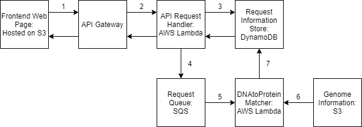

# DNAtoProtein
Serverless AWS-based webapp that searches genomes for the corresponding protein to DNA queries.

## Overall architecture

On our frontend, we have a simple static webpage hosted on S3 that can `POST` and `GET` to our API.  
Our API is hosted on API Gateway, which triggers a Lambda-based API Handler.  
This handler either gets or posts based on the HTTP Request. If the user gets, we simply query Dynamo and return the response. If the user posts, we put the value into Dynamo and then insert a message into SQS.  
SQS then triggers a Lambda to find the match, which involves getting genome data from another S3 bucket. When matching is finished, we update Dynamo.  

### Dynamo
We need a table with `userIP` as the primary partition key, and `id` as the primary sort key.

### SQS
A standard queue is fine for our use.

### API Gateway
Here we want to make a RESTful API, and define POST and GET requests, and enable CORS.  
Under integration request/mapping templates we want to request body passthrough **when there are no templates defined (recommended)** and then define the default mapping template. This lets us get the user's IP.

### S3
We need 2 buckets, one for our frontend and one for our genome data.  
Be sure to make your frontend bucket public, upload and make `index.html` public as well, and enable static webhosting to get an endpoint.  
Also be sure to change the endpoint in `index.html` to match the one given by API Gateway.
The bucket for genomic data can be private, as our Lambda functions will be able to access them via IAM Roles.

### Lambda
The first step is to make an IAM Policy for our Lambda functions. Enable Read Permissions for S3, and give FullAccess for Dynamo, SQS, and CloudWatch.  
We can equip this to an IAM Role for both of our Lambda functions. 

We need 2 Lambda functions, one to handle API Requests, and one to handle matching.

#### API Handler
Here we don't need to do anything special except enable the trigger from API Gateway, and change our URLs for SQS and Dynamo.  
The code for this function is provided as `DNAtoProteinAPIHandler\lambda_function.py`.

#### Matcher
First we need to add a `biopython` layer. I believe AWS provides a `numpy` layer, (at least they did for me), but if not, we need a layer for that as well, because it is a dependency. This is best explained in [this link](https://medium.com/swlh/how-to-add-python-pandas-layer-to-aws-lambda-bab5ea7ced4f).  
The code for this lambda is provided as `DNAtoProteinMatcher\lambda_function.py`
Then, lets add a trigger from SQS, with a batch size of 1, so we get 1 function invocation per request.  
Then we need to again change our URLs for Dynamo and S3.  
Additionally we may want to adjust our timeout period to a bit longer (I set mine to 10 minutes, but for this example likely 2 minutes is fine). Lambda assigns compute power based on memory, so it is possible to make this matcher faster, with a lower timeout, as I left mine on the smallest max memory limit, 128MB. 

## Overall assumptions
1. DNA requests are not longer than 256KB. (SQS messaging limit) 
2. Matching takes less than 15 minutes at most (Lambda max timeout) 
3. DNA requests expect to match based on original sequence or the reverse complement of the original sequence.
4. Users do not change IPs, because we use IP to find their past requests.
5. We do not have more than 1000 genomes in S3. (S3.listObjects limit)

## Benefits of this system design
1. As serverless as possible, so we only pay for what we use.
2. Cloud-based so could easily be expanded to multiple regions with low latency.
3. Easily handles multiple users and concurrent users.
